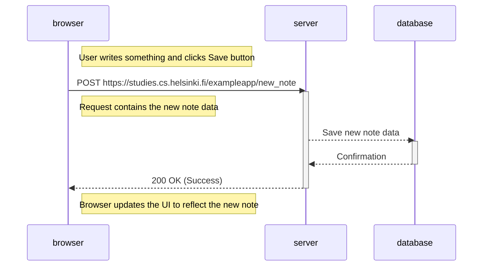

```mermaid
 sequenceDiagram
    participant browser
    participant server
    participant database

    Note right of browser: User writes something and clicks Save button

    browser->>server: POST https://studies.cs.helsinki.fi/exampleapp/new_note
    activate server

    Note right of browser: Request contains the new note data

    server-->>database: Save new note data
    activate database
    database-->>server: Confirmation
    deactivate database

    server-->>browser: 200 OK (Success)
    deactivate server

    Note right of browser: Browser updates the UI to reflect the new note

```
