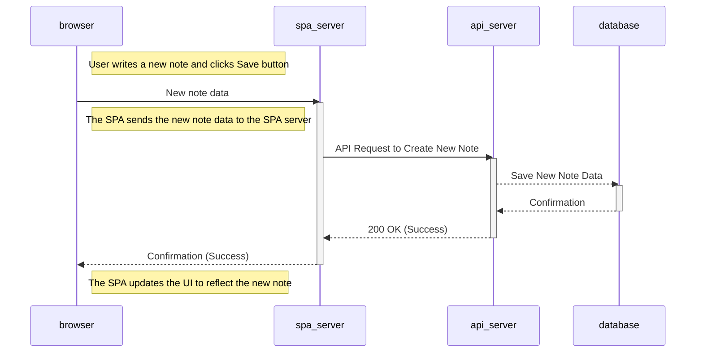

```mermaid
sequenceDiagram
    participant browser
    participant spa_server
    participant api_server
    participant database

    Note right of browser: User writes a new note and clicks Save button

    browser->>spa_server: New note data
    activate spa_server

    Note right of browser: The SPA sends the new note data to the SPA server

    spa_server->>api_server: API Request to Create New Note
    activate api_server

    api_server-->>database: Save New Note Data
    activate database
    database-->>api_server: Confirmation
    deactivate database

    api_server-->>spa_server: 200 OK (Success)
    deactivate api_server

    spa_server-->>browser: Confirmation (Success)
    deactivate spa_server

    Note right of browser: The SPA updates the UI to reflect the new note
```
